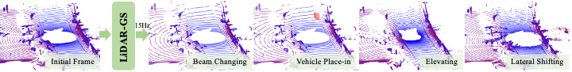
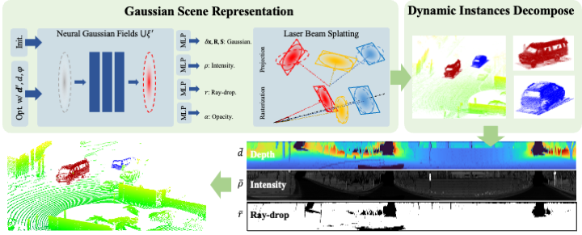

<h1 align="center">LiDAR-GS:Real-time LiDAR Re-Simulation using Gaussian Splatting</h1>
<!-- <h3 align="center">[CVPR 2024 - Highlight]</h3> -->
<p align="center">
   <a href="https://arxiv.org/abs/2410.05111.pdf">
      </a>
</p>
<!-- <p align="center">
   <a href="https://scholar.google.com.hk/citations?user=1ltylFwAAAAJ&hl=zh-CN&oi=sra">Tao Tang</a>
   ·
   <a href="https://wanggrun.github.io/">Guangrun Wang</a>
   ·
   <a href="https://scholar.google.com/citations?user=2w9VSWIAAAAJ&hl=en">Yixing Lao</a>
   ·
   <a href="https://damo.alibaba.com/labs/intelligent-transportation">Peng Chen</a>
   ·
   <a href="">Jie Liu</a>
    ·
   <a href="https://www.sysu-hcp.net/faculty/lianglin.html">Liang Lin</a>
   ·
   <a href="https://scholar.google.com.hk/citations?user=Jtmq_m0AAAAJ&hl=zh-CN&oi=sra">Kaicheng Yu</a>
   ·
   <a href="https://scholar.google.com/citations?user=voxznZAAAAAJ">Xiaodan Liang</a> -->
<p align="center">


</p>

**[Abstract]**: LiDAR simulation plays a crucial role in closed-loop simulation for autonomous driving. Although recent advancements, such as the use of reconstructed mesh and Neural Radiance Fields (NeRF), have made progress in simulating the physical properties of LiDAR, these methods have struggled to achieve satisfactory frame rates and rendering quality. To address these limitations, we present **LiDAR-GS**, the first LiDAR Gaussian Splatting method, for real-time high-fidelity re-simulation of LiDAR sensor scans in public urban road scenes. The vanilla Gaussian Splatting, designed for camera models, cannot be directly applied to LiDAR re-simulation. To bridge the gap between passive camera and active LiDAR, our LiDAR-GS designs a differentiable laser beam splatting, grounded in the LiDAR range view model. This innovation allows for precise surface splatting by projecting lasers onto micro cross-sections, effectively eliminating artifacts associated with local affine approximations. Additionally, LiDAR-GS leverages Neural Gaussian Fields, which further integrate view-dependent clues, to represent key LiDAR properties that are influenced by the incident angle and external factors. Combining these practices with some essential adaptations, e.g., dynamic instances decomposition, our approach succeeds in simultaneously re-simulating depth, intensity, and ray-drop channels, achieving state-of-the-art results in both rendering frame rate and quality on publically available large scene datasets. 

## Note
After the paper is accepted, source code will be made publicly available. If you have any questions about main-paper, please feel free to contact us.

## Video
<!-- <video width="320" height="240" controls>
  <source src="https://github.com/cjlunmh/LiDAR-GS/blob/main/video.mp4" type="video/mp4">
</video> -->
[more results](https://github.com/cjlunmh/LiDAR-GS/blob/main/video.mp4)

## Prepare and Run
Coming soon...


## Citation

If you find our code or paper helps, please consider citing:

```bibtex
@article{chen2024lidargs,
  title={LiDAR-GS:Real-time LiDAR Re-Simulation using Gaussian Splatting},
  author={Qifeng Chen, Sheng Yang, Sicong Du, Tao Tang, Peng Chen, Yuchi Huo},
  journal={arXiv preprint arXiv:2410.05111 },
  year={2024}
}
```


## Acknowledgments
Coming soon...